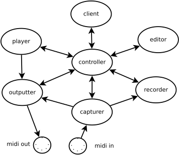

# Funk

**Note: This is experimental code under development. Don't expect
anything to work or even make sense!**

The intention is to develop a midi sequencer that resembles the midi-functionality of "The JAZZ Midi Sequencer". This
sequencer was developed by Andreas Voss and myself in the middle of the 1990's as a cross-platform program running on
Linux/Unix and Windows. The Linux sound architecture back then was not mature (to say the least), so the Linux drivers
soon stopped working as the OS evolved. The Windows version still works fine, thanks to some adaption work done by others
around 2008, but the GUI library used was deprecated years ago (it was written using wxWindows-1.68). The Jazz code 
itself is still the same as the version we released as open source 20 years ago, but these days it is a pain just to
make it compile with the deprecated libraries it uses, let alone to port it to a new environment. Several attempts
(by myself and others) has been made to port Jazz to a more modern GUI library, but the projects all dried up.

Jazz was (and still is) a very popular and practical program. I have yet to find a midi sequencer (at least for Linux)
that gives me the same efficiency in composing and editing with midi as Jazz does. A lot has happened with sound
libraries and gui possibilities since Jazz was written. The Linux sound interfaces are mature and work very well now.
Back in 1995 you could forget trying to make a real time midi sequencer based on anything other than C or C++; the
computers were just too slow. Today we can use interpreted languages like python and gui's based on javascript with
no performance problems. There is also an abundency of free code for lighting-fast communication and midi
access written as cross-platform libraries in a number of languages. So maybe the time has come to give it another
try?

This time I will start from scratch. Well, not entirely from scratch as there are so many great libraries to
build on now. I will also use the ideas that made Jazz such a usable program. The project gives me the benefit 
of re-learning python and at last learning how to write real javascript. It will be some time until I have
something that is useable, but I am encouraged by the speed of which the "proof of concept" program came together. 
Let's hope the progress continues at the same pace.

First there was JAZZ, then came FUNK!

## Prepare

sudo apt install python-pip

sudo apt-get install libasound2-dev

pip install python-rtmidi  --install-option="--no-jack"

pip install mido

sudo apt install python-mido

sudo apt install libzmq3-dev

sudo apt install libczmq-dev

pip install pyzmq

pip install git+https://github.com/Pithikos/python-websocket-server

## Architecture

The ellipses represent processes that exchange objects using pyobj serialization over zmq ipc. A zmq pub/sub proxy
implemented in C (not shown in the diagram) is acting as the message bus. The processes are currently implemented
in python.

The mido library is used to represent the midi elements, talk to the midi ports (via python-rtmidi) as well as
converting to/from midi files.

The first client is planned to be a web browser running javascript and html. The code is to be delivered either
via the local file system or via a simple webserver (e.g. python's SimpleHTTPServer). Communication between the
controller and the web-browser client is via websocket. The messages between the controller and the web-browser 
client are encoded as json and binary data is base64-encoded. Binary data exchange is supposed to be only the 
midi files, the rest should be plain text json.

The communication-based architecture makes scheduling between the different parts of the system very easy.
It also opens up for running different parts
of the system running on different machines (requires swapping zmq ipc with zmq tcp). It also allows for implementing
parts of the system in other languages (would probably need to change to another serialization protocol than
pyobj).

The controller acts as the communication hub. E.g. when the client orders a 'record' operation, the controller will
know what processes to contact for the simultaneous playback and record to happen:
- The client orders recording to start from a specific time into the song.
- The editor will receive the play command (via the contoller) and decide if the song needs to be loaded into the
player before playback.
- If needed, the editor will tell the player to load the file.
- The player and the recorder will simultaneously be told (by the editor) to start playing/recording at the specific time into the file.
- The player will play back the file by sending midi message objects to the outputter as well as sending time events to the client (via the controller,
for play progress information).
- The capturer will send captured midi message objects to the outputter (for loopback listening) as well as to the recorder.
- When the client issues stop (to both player and recorder via the controller), the recorder will deliver the recorded messages as a track directly to the editor.
- The editor will then deliver the altered file to the client (via the controller) for display.
